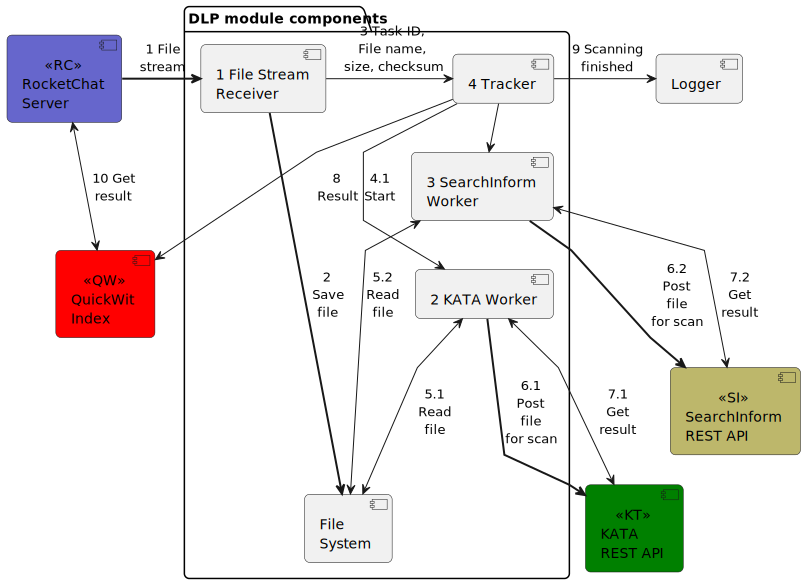

# Calam

Calam is a standalone service for files and messages inspection. It has modular architecture and can be extended for your personal needs.

_Usage_: `calam <COMMAND>`

_Commands_:
-  __scan__  Send filestreams to a clamd-analog service - FileReceiver (need to run it before)
-  __fr__    Run a FileReceiver node that saves stream to file, put it to local filesystem or S3-storage and post it to several DLP systems via REST API. Scan results will be pushed into a QuickWit index
-  __help__  Print this message or the help of the given subcommand(s)

_Options_:
-  -h, --help     Print help
-  -V, --version  Print version

_Example_:

```
calam scan -a localhost -p 3310 -f /path/to/file/eicar.com
```

## Components


