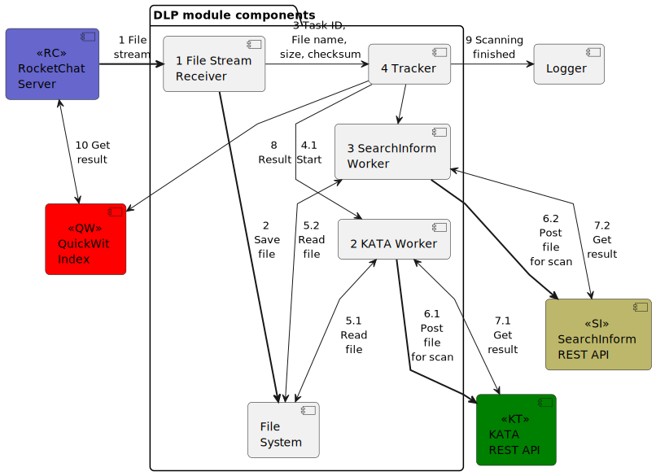

# Модульный аудит-конвейер "Калам"

Программное технологическое решение Модульный аудит-конвейер (МАК) "Калам"
представляет собой логически связанную совокупность программных модулей,
обеспечивающих последовательную и/или параллельную обработку поступающей по
нескольким каналам текстовой (сообщения) и бинарной (файлы) информации.

Алгоритм и последовательность этапов обработки для каждого канала или для
каждого типа информации могут быть определены администратором системы посредством
взаимодействия с графическим интерфейсом пользователя (WebUI) или через утилиты
командной строки (CLI).

## Принцип действия 

Обработка в зависимости от состава подключенных модулей может включать в себя:

- сканирование во встроенной или внешней (подключаемой по API) системе
  предотвращения утечек чувствительной информации (DLP),
- поиск, индексацию, замену паттернов текста или бинарных данных согласно заранее
  определённым администратором политикам и критериям,
- реагирование на триггерные паттерны данных: сигнализация в системы
  мониторинга, SIEM и/или уведомление ответственных сотрудников через
  сконфигурированные каналы связи - электронная почта, корпоративный чат и др.,
- сканирование в антивирусной системе, подключаемой по API,
- архивирование (запись дубликата) данных,
- поиск уязвимостей с использованием внешней системы, подключаемой по API[^1]
- проверку цифровой подписи файлов[^1],
- анализ данных при помощи большой языковой модели (LLM)[^2].

Ответ МАК "Калам" на передачу информации в зависисмости от состава подключенных
модулей включает в себя:

- результат сканирования во встроенной или внешней системе,
- исходную информацию, изменённую в соответствии с настроенными политиками и
  правилами,
- команду на удаление или изменение полученной информации на стороне источника
  (мессенджера, почтового сервера и др.)

МАК "Калам" **не является** антивирусной, SIEM или DLP-системой, но
предоставляет возможность тонкой настройки последовательности необходимых
проверок на ответственных участках передачи информации путём гибкой интеграции с
используемыми корпоративными системами защиты.

## Пример использования

МАК "Калам" имеет микросервисную архитектуру и поставляется в виде коробочного
решения, готового для разворачивания в облачной (контейнерной) инфраструктуре.

Ядро сервиса разработано в виде кроссплатформенного решения и может быть
установлено на серверах или рабочих станциях под управлением
Linux/FreeBSD/MacOS/Windows. Производство модулей адаптировано под среду
их выполнения и может быть дополнено спецификациями заказчика - архитектура
процессора, операционная система и пр.

МАК "Калам" является отечественной разработкой и совместим с отечествеными
операционными системами, такими как АстраЛинукс, отечественными мессенджерами
(Express), а также такими продуктами как Kaspersky KATA и SearchInform.
В качестве дополнительных входящих каналов могут быть подключены Telegram
и WhatsApp[^2].

[^1]: Не входит в базовый пакет. Предоставляется по подписке Medium и Premium.

[^2]: Не входит в базовый пакет. Предоставляется только по подписке Premium.
